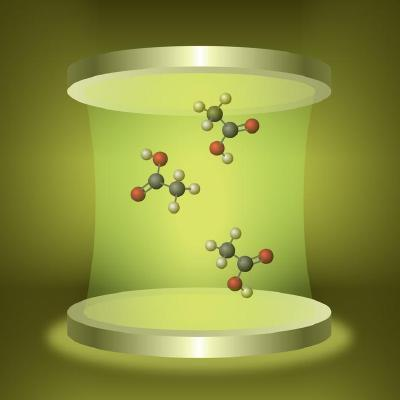

## MAny-Body Methods, Spectroscopies, and Dynamics for Molecular **POL**aritonic Systems (MAPOL)

### Overview

Our vision is to (1) develop a suite of theoretical frameworks, spanning low-order to high-level many-body  methods, that will provide unprecedented ability to capture the structure and dynamics of molecular  polaritonic systems, (2) deliver scalable software source code and libraries that can harness leadership-class  computational facilities (LCFs), and (3) nurture a community of practitioners in computational molecular  sciences. In pursuit of this vision, we propose three project objectives to guide our research program. 

- **Objective 1:** Polaritonic Many-Body Theories. Develop a Gaussian basis set–based suite of methods  spanning low-order to high-level ab initio many-body approaches for modeling and simulation of molecular  polaritonic systems.  
- **Objective 2:** High-Performance Computing and Automatic Differentiation Libraries. Implement  polaritonic many-body methods to fully utilize modern heterogeneous (CPU/GPU) high-performance  computing platforms at DOE’s LCFs and the National Energy Research Scientific Computing Center.  
- **Objective 3:** New Insights into the Physics and Chemistry of Molecular Polaritons. Apply developed  methods to molecular polaritonic systems to validate, benchmark, and assess our developments with  reference systems, progressing to advanced applications to complement experiments to enhance  fundamental understanding of polaritonic chemistry. 

### Team

- **Niranjan “Niri” Govind (Principal Investigator, PNNL)** is recognized for important contributions  to the development of linear and nonlinear spectroscopy methods based on real-time and linear-response  time-dependent density functional theory, X-ray spectroscopies, ultrafast dynamics, many-body methods,  embedding approaches, optimizers, orbital-free DFT, and applications to photoexcited molecular  complexes and materials. 
- **Karol Kowalski (co-PI, PNNL)** is an expert in advancing electronic structure methods and highly  scalable implementations of correlated many-body methods. He is recognized for important contributions  in CC theory including renormalized CC theories, multireference formulations, equation-of-motion linear response CC methods, and CC Green’s function formulations.  
- **Jonathan Foley (co-PI, University of North Carolina, Charlotte)** brings expertise in multiscale theory and modeling of light–matter  interactions and nanophotonics phenomena. He has developed novel theoretical methodologies combining  ab initio quantum chemistry with non-Hermitian cavity QED models leading to predictive theories for  polaritonic chemistry with explicit inclusion of photonic loss.  
- **Xiaosong Li (co-PI, University of Washington, Seattle)** is well known for his contributions to the  development of time-dependent electronic structure theory, relativistic many-body methods, and quantum dynamics. Li is also recognized for his important work in high-performance scientific software engineering,  numerical eigensolvers, and high-performance optimizers. 
 

### Publications

1. S. Banerjee, T. Zhang, K. G. Dyall, X. Li, **Relativistic Resolution-of-the-Identity with Cholesky Integral Decomposition**, J. Chem. Phys., 2023, 159, 114119

2. N. Vu, D. Mejia-Rodriguez, Nicholas P. Bauman, A. Panyala, E. Mutlu, N. Govind, J. Foley, **Cavity Quantum Electrodynamics Complete Active Space Configuration Interaction Theory** J. Chem. Theory. Comput, 2024, 20, 1214-1227, https://doi.org/10.1021/acs.jctc.3c01207

3. RR. Manderna, N. Vu, J. Foley, **Comparing parameterized and self-consistent approaches to ab initio CQED for molecular polaritonic systems** (ChemRxiv 10.26434/chemrxiv-2024-4xc02, 2024)

4. H. Pathak, A. Panyala, N.P. Bauman, D. Mejia-Rodriguez, N. Govind, K. Kowalski, **Quantum Electrodynamics Coupled-Cluster Theory: Exploring Photon-Induced Electron Correlations** in preparation (to be submitted to Phys. Rev. A). We have run the largest QED-CCSD calculation to date on the nitroaniline system (aug-cc-pVQZ basis set, 1056 basis functions). This calculation was performed on the Aurora supercomputer at ALCF at Argonne National Laboratory using our CPU/GPU implementation of QED-CCSD within the ExaChem framework.

5. D. Mejia-Rodriguez, N. Vu, J. Foley, N. Govind, **Real-Time Time-Dependent Cavity Quantum Electrodynamics in Gaussian Basis** (to be submitted to JCTC)

6. D. Mejia-Rodriguez, N. Govind, **Non-Local Correlation Functional from the Jellium with a Local Gap Model** (in preparation)

7. E.J. Bylaska, A. Panyala, B. Peng, D. Mejia-Rodriguez, N. Govind, K. Kowalski, et al. **Electronic structure simulations in cloud computing environment** in preparation (to be submitted to J. Chem. Phys. as a perspective paper)

8. Matoušek, Mikuláš; Vu, Nam; Govind, Niranjan; Foley, Jonathan J. IV; Veis, Libor. **Polaritonic Chemistry Using the Density Matrix Renormalization Group Method.** Journal of Chemical Theory and Computation (Oct 2024) [DOI:10.1021/acs.jctc.4c00986](https://doi.org/10.1021/acs.jctc.4c00986)

### Acknowledgements
